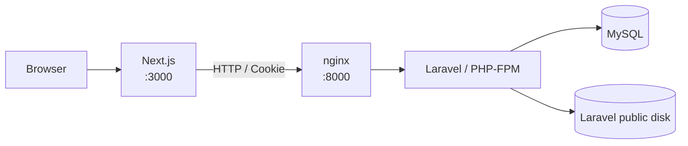

# Animal Album App

動物の写真や動画を投稿・整理し、あとから見返せるアルバム管理アプリです。未ログインでも投稿の一覧・詳細を閲覧でき、ログインすると投稿、お気に入り登録・解除、自分の投稿の削除ができます。

## 制作背景・目的

スマートフォンやPC、クラウドストレージに分散しがちな動物の写真・動画を一か所にまとめ、カテゴリや撮影日から探しやすくすることを目的に制作しました。

Next.jsとLaravelを分離した構成で、画面、認証、API、データベース、ファイル保存、各レイヤーのテストまで一連のWebアプリケーション開発を実践することも目的としています。

## 主な機能

- ユーザー登録、ログイン、ログアウト
- 写真・動画の一覧表示と詳細表示（未ログインでも閲覧可能）
- 画像・動画のアップロード（ログイン必須）
- カテゴリ、撮影日、メモの登録
- 画像のEXIF情報から撮影日を取得
- カテゴリおよび画像・動画による絞り込み
- 撮影日の新しい順・古い順による並び替え
- 通常一覧、自分の投稿、お気に入り一覧の20件単位のページネーション
- お気に入り登録・解除（ログイン必須）
- マイページで「自分の投稿」と「お気に入り」をタブ切り替えで表示（ログイン必須）
- 投稿者本人による投稿の削除
- ローディング、エラー、空状態の表示
- レスポンシブ対応

## 使用技術

| 分類 | 技術 |
| --- | --- |
| フロントエンド | Next.js 16、React 19、TypeScript、Tailwind CSS 4、Axios |
| バックエンド | PHP 8.4、Laravel 13、Laravel Fortify、Laravel Sanctum |
| データベース | MySQL 8.4 |
| Webサーバー | nginx |
| ファイル保存 | Laravel public disk（ローカルストレージ） |
| テスト | PHPUnit 12、Vitest 4、Testing Library、Playwright 1.61 |
| 開発環境 | Docker、Docker Compose |

依存関係の正確なバージョンは、`backend/composer.lock`と`frontend/package-lock.json`を参照してください。

## システム構成



Docker Composeのサービスは次のとおりです。

| サービス | 役割 |
| --- | --- |
| `frontend` | Next.js開発サーバー |
| `nginx` | Laravel APIと保存ファイルへのHTTPリクエスト受付 |
| `backend` | Laravel / PHP-FPM |
| `db` | MySQL |
| `phpmyadmin` | ローカルDB確認用UI |
| `playwright` | ChromiumによるE2Eテスト |

認証にはFortifyとSanctumのCookieベース認証を使用しています。一覧・詳細APIは公開し、投稿・削除・お気に入りAPIは認証必須にしています。

## ローカル環境構築

### 前提

- Git
- Docker
- Docker Compose

### 1. リポジトリを取得

```bash
git clone git@github.com:nasu-masa/Animal-Album-App.git
cd Animal-Album-App
```

### 2. 環境変数を作成

```bash
cp .env.example .env
cp backend/.env.example backend/.env
cp frontend/.env.example frontend/.env.local
```

各exampleファイルにはローカル開発用の設定例が含まれています。

| ファイル | 主な用途 |
| --- | --- |
| `.env` | Docker ComposeからMySQLへ渡すDB名・ユーザー情報 |
| `backend/.env` | Laravel、DB接続、セッション、ファイルシステム、機能フラグ |
| `frontend/.env.local` | API URL、画面側の機能フラグ |

`backend/.env`の`APP_KEY`は後述の`key:generate`で生成します。exampleにない秘密鍵や本番環境の認証情報をREADMEへ記載しないでください。

### 3. Laravelの書き込み権限を設定（Linux / WSL）

```bash
sudo ./setup-permissions.sh
```

bind mountする`backend/storage`と`backend/bootstrap/cache`を、コンテナ内の`www-data`が書き込める状態にします。Docker Desktopなど権限の扱いが異なる環境では、ホスト環境に合わせた調整が必要になる場合があります。

### 4. コンテナをビルドして起動

```bash
docker compose up -d --build frontend phpmyadmin
docker compose ps
```

`playwright`サービスはE2Eテスト実行用のため、通常起動には含めません。依存関係により`db`、`backend`、`nginx`も起動します。

### 5. Laravelをセットアップ

```bash
docker compose exec backend composer install
docker compose exec backend php artisan key:generate
docker compose exec backend php artisan migrate --seed
docker compose exec backend php artisan storage:link
```

`storage:link`は必要です。Seederとアップロード機能は`storage/app/public`へファイルを保存し、nginxは`public/storage`経由で配信します。

既存データを削除して初期状態へ戻す場合は、次を実行します。

```bash
docker compose exec backend php artisan migrate:fresh --seed
```

> `migrate:fresh`は全テーブルを削除して再作成します。必要なデータがないことを確認してから実行してください。

### 6. アクセス

| 内容 | URL |
| --- | --- |
| フロントエンド | `http://localhost:3000` |
| Laravel API | `http://localhost:8000` |
| phpMyAdmin | `http://localhost:8080` |

### 7. 停止

```bash
docker compose down
```

MySQLのDocker volumeも削除する場合のみ、`docker compose down -v`を使用してください。

## 初期データとSeeder

`DatabaseSeeder`は次の順にSeederを実行します。

1. `UserSeeder`：デモユーザーを含む5ユーザーを作成
2. `MediaSeeder`：画像23件・動画2件をpublic diskへコピーし、メディア情報を作成
3. `FavoriteSeeder`：デモユーザーのお気に入り4件を作成

Seeder用ファイルは次の場所に含まれています。

```text
backend/database/seeders/assets/media/
├── images/
└── videos/
```

`MediaSeeder`がこれらを`storage/app/public/media/seed/`へコピーするため、手作業でのコピーは不要です。ファイルが不足している場合はSeederが例外を返します。ブラウザから表示するには、環境構築時の`php artisan storage:link`を実行してください。

### ローカル開発用Seederユーザー

ローカルで`--seed`を実行した後、次のユーザーでログインできます。

| 名前 | メールアドレス | パスワード |
| --- | --- | --- |
| Demo User | `demo@example.com` | `demo1234` |

この認証情報はローカル開発専用であり、公開デモでは使用しません。本番環境の認証情報としても使用しないでください。

### 公開デモ用認証情報

公開デモ環境の認証情報はREADMEには記載せず、必要に応じて個別に案内します。

## テスト

### Laravel / PHPUnit

PHPUnitはインメモリSQLiteを使用するため、ローカルのMySQLデータを変更しません。

```bash
docker compose exec backend php artisan test
```

PHPUnitを直接実行する場合：

```bash
docker compose exec backend ./vendor/bin/phpunit
```

### Vitest

```bash
docker compose exec frontend npm run test:unit
```

### Playwright

アプリを起動し、マイグレーションとSeederを完了した状態で実行します。

```bash
docker compose run --rm playwright
```

PlaywrightはChromiumを使用し、ログイン、新規登録、一覧から詳細への遷移、マイページのタブ切り替えを確認します。
新規登録テストは実行のたびに一意なメールアドレスのユーザーをDBへ作成します。必要に応じて`migrate:fresh --seed`で初期化してください。

### フロントエンドのその他の確認

現在のnpm scriptsは`dev`、`build`、`start`、`lint`、`test:unit`、`test:e2e`です。

```bash
docker compose exec frontend npm run lint
docker compose exec frontend npx tsc --noEmit
```

ホスト側に依存関係とPlaywrightブラウザを用意している場合は、`frontend`ディレクトリで`npm run test:e2e`も実行できます。

## ディレクトリ構成

```text
Animal-Album-App/
├── backend/
│   ├── app/                 # API、Form Request、Model、認証処理
│   ├── database/            # Migration、Factory、Seeder、初期メディア
│   ├── routes/              # Laravelのルート定義
│   └── tests/               # PHPUnitのUnit / Featureテスト
├── frontend/
│   ├── src/app/             # Next.js App Routerのページ
│   ├── src/components/      # UIコンポーネント
│   ├── src/lib/             # API通信、認証、EXIF処理
│   └── e2e/                 # Playwrightテスト
├── docker/                  # PHP、nginx、MySQL、Next.jsの設定
├── docker-compose.yml
└── README.md
```

## 設計・実装上の工夫

- Next.jsとLaravel APIの責務を分離し、サーバー側取得とブラウザ側操作で共通のAPIを利用
- SanctumのCookie認証とCSRF Cookieを使用し、認証が必要なAPIを保護
- 一覧・詳細は公開し、投稿、削除、お気に入りは認証必須にするアクセス制御
- 削除は投稿者本人だけに許可し、レコードにはソフトデリートを採用
- MIMEタイプ、100MB上限、カテゴリ、撮影日、メモ長をLaravel側で検証
- アップロード時にランダムな保存ファイル名を利用し、元のファイル名を公開パスに使用しない
- 一覧の絞り込み・並び替え・ページ番号をURLクエリとして保持
- PHPUnitのFeatureテスト、Vitestのコンポーネントテスト、Playwrightの主要動線テストを用途別に配置
- Seeder用ファイルの存在確認後にコピーし、不完全な初期データ作成を検知

## 公開デモ環境の制限

公開デモ環境では共有データとストレージを保護するため、新規登録、アップロード、削除を無効にします。ローカル環境ではこれらを含む全機能を利用できます。

| 操作 | 公開デモでの利用可否 |
| --- | --- |
| 一覧・詳細の閲覧 | 未ログインでも利用可能 |
| 新規登録 | 停止 |
| ログイン | 個別に案内する認証情報で利用可能 |
| お気に入り登録・解除 | 利用可能 |
| マイページ | 利用可能 |
| アップロード | 停止 |
| 削除 | 停止 |

これは機能不足による制限ではなく、不特定多数によるストレージ悪用と共有デモデータの破壊を防ぐための意図的な運用方針です。新規登録、アップロード、削除は、次の機能フラグで制御します。

バックエンド（実行時）：

```env
REGISTRATION_ENABLED=false
MEDIA_UPLOAD_ENABLED=false
MEDIA_DELETE_ENABLED=false
```

フロントエンド（ビルド時）：

```env
NEXT_PUBLIC_REGISTRATION_ENABLED=false
NEXT_PUBLIC_MEDIA_UPLOAD_ENABLED=false
NEXT_PUBLIC_MEDIA_DELETE_ENABLED=false
```

## 今後の改善

- メールアドレス認証と認証メール再送
- アップロードのレート制限、ユーザー単位の件数・容量制限、ストレージ監視
- S3などのオブジェクトストレージ対応
- 削除済みメディアの復元と、不要ファイルのライフサイクル管理
- CIによる自動テスト・静的解析
- テストケース、アクセシビリティ、UIの改善
