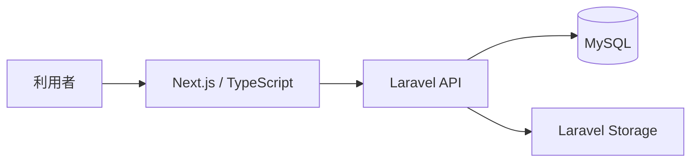
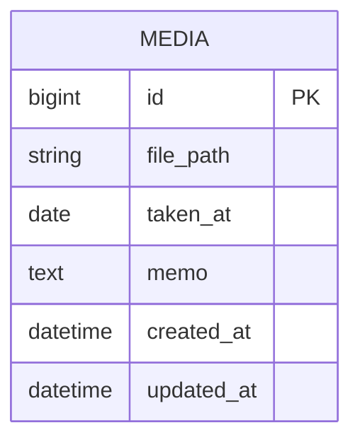

# Animal Album

家族で動物の写真を保存し、撮影日やメモと一緒に見返せるアルバム管理アプリです。

最初のMVPでは、家族で飼っている猫の写真管理を対象としています。将来的には、ほかのペットや動物の写真も管理できるよう拡張することを想定しています。


Next.js・TypeScript・Laravelの学習と、フロントエンドからAPIまでの一連の開発経験を目的として制作しています。

> 現在開発中です。READMEには実装済みの内容を中心に掲載します。

---

## アプリ概要

猫の写真が端末やフォルダに分散し、後から探しにくいという課題を解決するために制作しています。

写真を一覧で確認し、撮影日やメモと一緒に管理できるシンプルなアルバムを目指しています。

### 想定利用者

* 自分
* 家族

---

## 画面イメージ

READMEでは、アプリの内容が伝わりやすい画面だけを掲載します。

### 写真一覧

<!-- 実装後に画像を追加 -->

```markdown

```

猫の写真、撮影日、メモの一部を一覧で確認できます。

### 写真詳細

<!-- 実装後に画像を追加 -->

```markdown

```

選択した写真の撮影日やメモを確認できます。

### 写真投稿

<!-- 実装後に画像を追加 -->

```markdown

```

画像、撮影日、メモを登録できます。

---

## 主な機能

### 実装済み

<!-- 実装が完了したものだけ残す -->

* [ ] 猫写真の一覧表示
* [ ] 猫写真の詳細表示
* [ ] 画像アップロード
* [ ] 撮影日の登録・表示
* [ ] メモの登録・表示
* [ ] Laravel APIからのデータ取得
* [ ] ローディング表示
* [ ] エラー表示
* [ ] データがない場合の空状態表示
* [ ] スマートフォン対応

### 今後の実装候補

最初のMVP完成後、必要に応じて追加します。

* ユーザー登録・ログイン
* お気に入り
* 日付検索
* 投稿者による絞り込み
* カテゴリによる絞り込み
* 削除・ソフトデリート
* 動画対応

---

## 使用技術

### フロントエンド

* Next.js
* TypeScript
* Tailwind CSS

### バックエンド

* Laravel
* PHP

### データベース

* MySQL

### 開発環境

* Docker
* Docker Compose
* nginx
* Git
* GitHub

<!-- 実際に使用しているバージョンが確定したら追記 -->

---

## システム構成



---

## ER図

現在の実装内容に合わせて更新します。



詳しい設計資料は以下に掲載予定です。

* [ER図](docs/database/er-diagram.md)
* [テーブル仕様書](docs/database/table-spec.md)

---

## API

最初のMVPでは、以下のAPIを実装します。

| メソッド | URL               | 内容      |
| ---- | ----------------- | ------- |
| GET  | `/api/media`      | 写真一覧の取得 |
| GET  | `/api/media/{id}` | 写真詳細の取得 |
| POST | `/api/media`      | 写真の投稿   |

APIの詳細なリクエスト・レスポンスは、必要に応じて別の設計資料へ記載します。

---

## 環境構築

### 1. リポジトリをクローン

```bash
git clone <リポジトリURL>
cd <リポジトリ名>
```

### 2. 環境変数を作成

```bash
cp backend/.env.example backend/.env
cp frontend/.env.example frontend/.env.local
```

環境に合わせてデータベース接続情報やAPIのURLを設定します。

### 3. Dockerを起動

```bash
docker compose up -d --build
```

### 4. Laravelをセットアップ

```bash
docker compose exec php composer install
docker compose exec php php artisan key:generate
docker compose exec php php artisan migrate --seed
docker compose exec php php artisan storage:link
```

### 5. フロントエンドをセットアップ

```bash
cd frontend
npm install
npm run dev
```

> コマンドやコンテナ名は、実際のDocker構成が確定した段階で修正します。

---

## 開発用URL

| 内容          | URL                     |
| ----------- | ----------------------- |
| フロントエンド     | `http://localhost:3000` |
| Laravel API | `http://localhost`      |
| phpMyAdmin  | `http://localhost:8080` |
| MailHog     | `http://localhost:8025` |

<!-- 実際のポート番号に合わせて修正 -->

---

## 工夫した点

<!-- 実際に工夫した内容へ置き換える -->

### 小さな単位で実装する

最初からすべての機能を作るのではなく、写真一覧、詳細、投稿の順に機能を分けて実装しています。

### フロントエンドとAPIを機能ごとにつなぐ

フロントエンド全体とバックエンド全体を別々に完成させるのではなく、一覧機能ごとにNext.jsとLaravelを接続しながら進めています。

## AIの活用について

開発では、ChatGPT、Claude Code、Codexを補助的に使用しています。

* ChatGPT：要件整理、学習、実装範囲の確認
* Claude Code：機能単位の実装、動作確認
* Codex：実装後のコードレビュー

AIへアプリ全体を一度に作らせるのではなく、機能を小さく区切って使用しています。

生成されたコードについては、変更されたファイル、各ファイルの役割、データの流れを確認し、自分の言葉で説明できる状態を目指しています。


## MVPで検証する仮説

家族は、猫の写真や動画を撮影日や投稿者から簡単に探して
見返せる専用アプリに価値を感じる。

## MVPで提供する価値

猫の写真や動画を保存し、後から迷わず見つけて見返せること。

## 検証方法

家族に実際に利用してもらい、アップロード、絞り込み、
お気に入りの利用状況と操作上の不便を確認する。

## 今後の改善

<!-- 多くしすぎず、3〜5件程度に絞る -->

* 認証機能の追加
* お気に入り機能の追加
* 日付による検索
* テストの追加
* 操作性とデザインの改善

---

## 制作者

<!-- GitHubプロフィールなどを追加 -->

* GitHub：`https://github.com/<ユーザー名>f`
