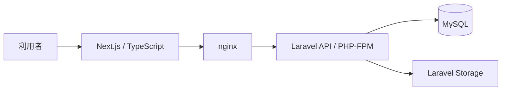
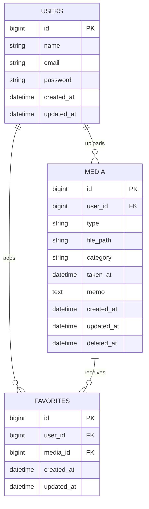

# Animal Album

家族で動物の写真や動画を保存し、撮影日・投稿者・カテゴリなどから探して見返せるアルバム管理アプリです。

最初のMVPでは、家族で飼っている猫の写真・動画管理を対象としています。将来的には、ほかのペットや動物にも対応できる構成を想定しています。

Next.js・TypeScript・Laravelを使用し、フロントエンドからAPI、データベース、ファイル保存までの一連の開発経験を身につけることを目的として制作しています。

> 現在開発中です。
> Docker開発環境とLaravelの初期設定が完了し、これからアプリケーション機能を実装します。

---

## アプリ概要

猫の写真や動画がスマートフォン、PC、クラウドストレージなどに分散し、後から見つけにくいという課題を解決するために制作しています。

写真や動画を一か所へ保存し、撮影日・投稿者・カテゴリ・お気に入りなどから簡単に探して見返せる、家族向けのシンプルなアルバムを目指しています。

### 想定利用者

* 自分
* 家族

---

## MVPで検証する仮説

家族は、猫の写真や動画を撮影日や投稿者などから簡単に探して見返せる専用アプリに価値を感じる。

## MVPで提供する価値

猫の写真や動画を一か所へ保存し、後から迷わず見つけて見返せること。

## 検証方法

家族に実際に利用してもらい、以下を確認します。

* 写真・動画のアップロード状況
* 日付や投稿者による絞り込みの利用状況
* お気に入り機能の利用状況
* 操作中に迷った箇所
* 追加してほしい機能

---

## 画面イメージ

実装後、アプリの内容が伝わりやすい主要画面を掲載します。

### メディア一覧

<!-- 実装後に画像を追加 -->

```markdown

```

写真や動画、撮影日、投稿者、メモの一部を一覧で確認できます。

### メディア詳細

<!-- 実装後に画像を追加 -->

```markdown

```

選択した写真・動画の撮影日、投稿者、カテゴリ、メモを確認できます。

### アップロード

<!-- 実装後に画像を追加 -->

```markdown

```

写真・動画、撮影日、カテゴリ、メモを登録できます。

### お気に入り一覧

<!-- 実装後に画像を追加 -->

```markdown

```

自分がお気に入り登録した写真・動画を一覧で確認できます。

---

## 主な機能

### MVPで実装予定

* [ ] ユーザー登録
* [ ] ログイン・ログアウト
* [ ] 写真・動画の一覧表示
* [ ] 写真・動画の詳細表示
* [ ] 写真・動画のアップロード
* [ ] 撮影日の登録・表示
* [ ] メモの登録・表示
* [ ] カテゴリの登録・表示
* [ ] お気に入り登録・解除
* [ ] お気に入り一覧表示
* [ ] 年・月・日による絞り込み
* [ ] 投稿者による絞り込み
* [ ] カテゴリによる絞り込み
* [ ] 画像・動画による絞り込み
* [ ] 新しい順・古い順の並び替え
* [ ] 投稿者本人による削除
* [ ] Laravel APIからのデータ取得
* [ ] ページネーション
* [ ] ローディング表示
* [ ] エラー表示
* [ ] データがない場合の空状態表示
* [ ] スマートフォン対応

### MVP完成後の改善候補

* マイページ
* 削除したメディアの復元
* S3へのファイル保存
* テストの拡充
* 操作性とデザインの改善
* 対応する動物カテゴリの拡張

---

## 使用技術

### フロントエンド

* Next.js
* React
* TypeScript
* Tailwind CSS

### バックエンド

* Laravel
* PHP
* Laravel Fortify

### データベース

* MySQL 8.4

### Webサーバー

* nginx

### 開発環境

* Docker
* Docker Compose
* Git
* GitHub

### 開発支援

* ChatGPT
* Claude Code
* Codex

---

## システム構成



### 各サービスの役割

| サービス         | 役割                   |
| ------------ | -------------------- |
| `frontend`   | Next.jsの開発サーバー       |
| `nginx`      | LaravelへのHTTPリクエスト受付 |
| `backend`    | Laravel・PHP-FPMの実行   |
| `db`         | MySQLによるデータ保存        |
| `phpmyadmin` | ブラウザからのDB確認          |

---

## ディレクトリ構成

```text
Animal-Album-App/
├── backend/                  # Laravel
├── frontend/                 # Next.js
├── docker/
│   ├── frontend/
│   │   └── Dockerfile
│   ├── mysql/
│   │   └── my.cnf
│   ├── nginx/
│   │   └── default.conf
│   └── php/
│       ├── Dockerfile
│       └── php.ini
├── docs/                     # 設計資料
├── docker-compose.yml
├── .env.example
└── README.md
```

---

## データベース設計

MVPでは、主に以下のテーブルを使用する予定です。



### 主なテーブル

#### users

ユーザー情報を管理します。

#### media

アップロードされた写真・動画と、撮影日、カテゴリ、メモなどを管理します。

#### favorites

ユーザーがお気に入り登録したメディアを管理します。

詳しい設計資料は以下に掲載します。

* [ER図](docs/database/er-diagram.md)
* [テーブル仕様書](docs/database/table-spec.md)

---

## API

以下はMVPで実装予定のAPIです。

### 認証

| メソッド   | URL         | 内容     |
| ------ | ----------- | ------ |
| `POST` | `/register` | ユーザー登録 |
| `POST` | `/login`    | ログイン   |
| `POST` | `/logout`   | ログアウト  |

### メディア

| メソッド     | URL               | 内容        |
| -------- | ----------------- | --------- |
| `GET`    | `/api/media`      | メディア一覧の取得 |
| `POST`   | `/api/media`      | メディアの投稿   |
| `GET`    | `/api/media/{id}` | メディア詳細の取得 |
| `DELETE` | `/api/media/{id}` | メディアの削除   |

### お気に入り

| メソッド     | URL                        | 内容         |
| -------- | -------------------------- | ---------- |
| `POST`   | `/api/media/{id}/favorite` | お気に入り登録    |
| `DELETE` | `/api/media/{id}/favorite` | お気に入り解除    |
| `GET`    | `/api/favorites`           | お気に入り一覧の取得 |

APIの詳細なリクエスト・レスポンスは、実装に合わせて別の設計資料へ記載します。

---

## 環境構築

### 前提環境

以下がインストールされていることを前提とします。

* Git
* Docker
* Docker Compose

### 1. リポジトリをクローン

```bash
git clone <リポジトリURL>
cd Animal-Album-App
```

### 2. 環境変数を作成

```bash
cp .env.example .env
cp frontend/.env.example frontend/.env.local
cp backend/.env.example backend/.env
```

各ファイルの用途は以下のとおりです。

| ファイル                  | 用途                             |
| --------------------- | ------------------------------ |
| `.env`                | Docker Compose・MySQLの設定        |
| `frontend/.env.local` | Next.jsからLaravel APIへ接続するための設定 |
| `backend/.env`        | Laravelのアプリケーション・DB接続設定        |

`.env`にはローカル開発用の値を設定します。

```env
MYSQL_DATABASE=animal_album_app
MYSQL_USER=app
MYSQL_PASSWORD=secret
MYSQL_ROOT_PASSWORD=root
```

`frontend/.env.local`にはLaravel APIのURLを設定します。

```env
NEXT_PUBLIC_API_URL=http://localhost:8000
```

`backend/.env`のDB接続設定は以下のようにします。

```env
DB_CONNECTION=mysql
DB_HOST=db
DB_PORT=3306
DB_DATABASE=animal_album_app
DB_USERNAME=app
DB_PASSWORD=secret
```

### 3. Laravelの書き込み権限を設定（Linux / WSL）

```bash
sudo ./setup-permissions.sh
```

Laravelはホストからbind mountした`backend/storage`と`backend/bootstrap/cache`へ書き込みます。
PHP-FPMはコンテナ内の`www-data`（GID 33）で動作するため、初回起動前にこのスクリプトを実行してください。

スクリプトは所有者をホストユーザーのまま維持し、グループをGID 33へ変更してグループ書き込みを許可します。
ディレクトリには`2775`（setgidを含む）、ファイルには`0664`を設定します。

> macOSなど、ホスト側でGID 33が別の用途に割り当てられている環境や、Docker Desktopのbind mountがLinuxと異なる権限変換を行う環境では、この固定GIDが適合しない可能性があります。この手順はLinux / WSL向けです。macOSでbackendコンテナが書き込み不可として停止する場合は、GIDを固定せずホスト環境へ合わせる構成を別途検討してください。

### 4. Dockerイメージをビルドして起動

```bash
docker compose up -d --build
```

コンテナの状態を確認します。

```bash
docker compose ps
```

### 5. Laravelをセットアップ

```bash
docker compose exec backend composer install
docker compose exec backend php artisan key:generate
docker compose exec backend php artisan migrate
docker compose exec backend php artisan storage:link
```

マイグレーション状況は、以下のコマンドで確認できます。

```bash
docker compose exec backend php artisan migrate:status
```

### 6. 動作確認

ブラウザから以下へアクセスします。

| 内容         | URL                     |
| ---------- | ----------------------- |
| フロントエンド    | `http://localhost:3000` |
| Laravel    | `http://localhost:8000` |
| phpMyAdmin | `http://localhost:8080` |

### 7. コンテナを停止

```bash
docker compose down
```

DBデータも含めて削除する場合は、以下を実行します。

```bash
docker compose down -v
```

> `-v`を付けるとMySQLのデータも削除されます。

---

## 今後の改善

MVP完成後、利用状況やフィードバックをもとに改善します。

* S3へのファイル保存
* 削除したメディアの復元
* テストの拡充
* CIの導入
* 操作性とデザインの改善

---

## 制作者

* GitHub：`https://github.com/nasu-masa
